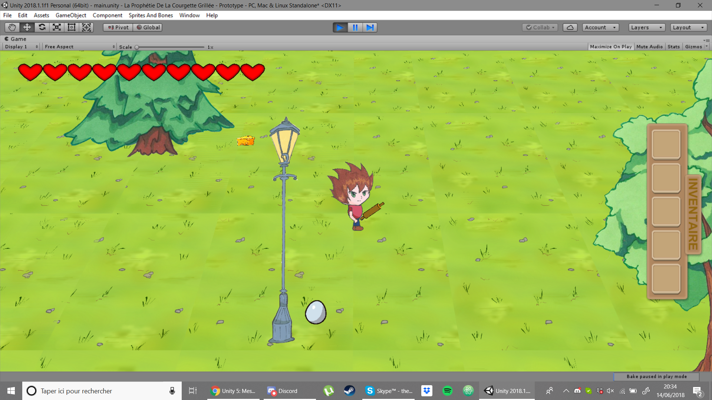
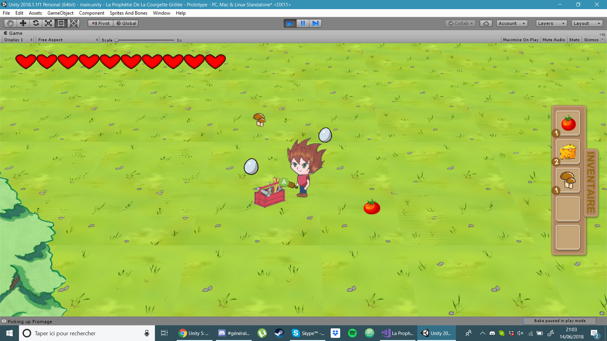
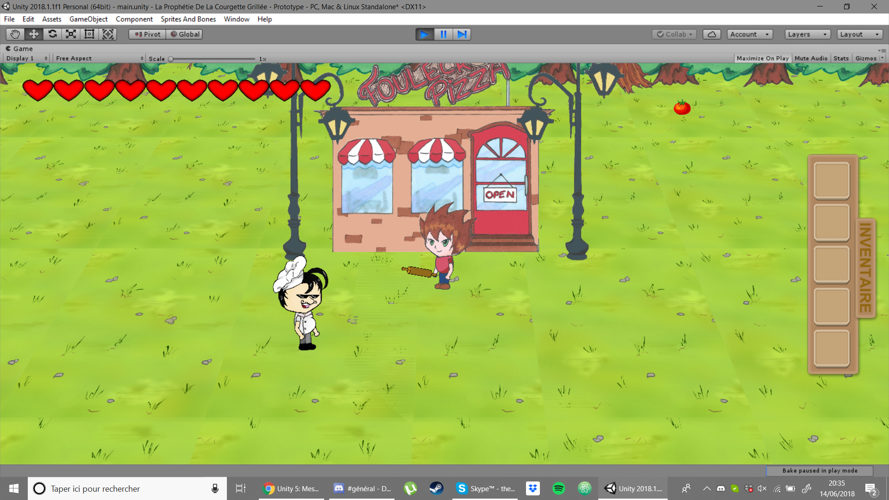

# Grilled Zucchini Prophecy

This project is a prototype of a game in Unity. It comes from an old student project which lasted one year and a half.

The game is using the same camera style as don't starve game, that is, creating a 3D world with 2D sprites.

This is an early prototype and is not playable at all. Many feature were implemented such as inventory and crafting mechanism, quest and combat system and more.

The main goal of this project was to improve our skills in video game development. This was a really interesting project to work on, we learnt a lot, not only in pure development but also on texture creation, animations...

Here are some images of the game :

